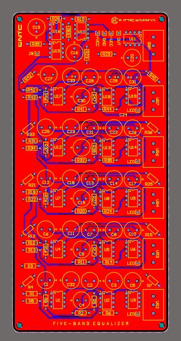

# Five-Band Audio Equalizer

## Overview

The Five-Band Audio Equalizer project focuses on the development and implementation of a graphic equalization circuit that can manipulate audio signals across five specific frequency bands. Designed as part of the Laboratory Practice module in semester 3, this project aims to enhance hands-on skills in electronics by creating a fully functional audio equalizer using operational amplifier (op-amp) based active filters, enabling the adjustment of gains across the low, mid, and high-frequency ranges.

## Features

- **Adjustable Frequency Bands**: Control over five specific frequency ranges for detailed audio customization.
  - Low: 20-300Hz
  - Low Mid: 300-1kHz
  - Mid: 1kHz-4kHz
  - High Mid: 4kHz-10kHz
  - High: 10kHz-20kHz
- **Active Filtering**: Utilization of low-pass, high-pass, and band-pass filters to isolate and adjust specific frequency bands.
- **Op-Amp Circuits**: Employment of operational amplifiers for the filter circuits, ensuring high-quality signal processing.

## Tools Used

- **Circuit Design & Simulation**: Filter Pro for filter calculations and NI Multisim for circuit simulation.
- **PCB Design**: Altium Designer for creating the printed circuit board layout.
- **Enclosure Design**: SolidWorks for designing the custom enclosure.

### Circuit Design

#### Equilizer Circuit

##### Schematic Diagram

##### PCB Layout

##### PCB 3D View

#### LED Display Circuit

##### Schematic Diagram

##### PCB Layout

##### PCB 3D View

### Enclosure Design

The enclosure design was developed using SolidWorks, focusing on aesthetics, functionality, and durability.

#### Enclosure

## Team Members - ElectroMavericks Team

This project is proudly developed by the ElectroMavericks Team:

- [**Prabodha K.P.K.A**](https://github.com/AkhilaPrabodha)
- [**Vidmal H.V.P**](https://github.com/pulinduvidmal)
- [**Nayanthara J.N.P**](https://github.com/Navini11)
- [**Surendra S.A.J.E**](https://github.com/eshansurendra)
